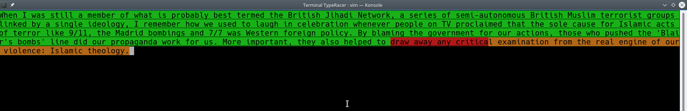

# Terminal TypeRacer
Here's Terminal TypeRacer!
It's for all those who are bored, and live on the terminal :P

## Screenshot:

## Dependencies
1. [ncurses library](https://www.cyberciti.biz/faq/linux-install-ncurses-library-headers-on-debian-ubuntu-centos-fedora/)
2. python wikiquotes package `pip3 install wikiquote`
